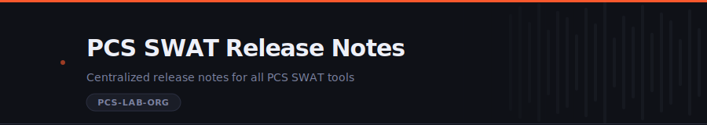

<div align="center">


</div>


User-facing release notes and engineering milestone records for all PCS SWAT tools.
Each tool has its own section — Cortex product suite on one end, internal automation on the other.
Release notes are self-contained HTML files served as a static site.

**Release notes portal:** [`PCS-LAB-ORG/swat-releases`](https://github.com/PCS-LAB-ORG/swat-releases) *(GitHub Pages — enable in repo Settings → Pages)*


### Quick navigation

[Tools](#tools) · [Adding a release](#adding-a-release) · [Local development](#local-development) · [Repository structure](#repository-structure) · [Branching](#branching)


## Tools

Six tools are tracked in this repo. Click any tool to expand its release history.

<details>
<summary><b>AI Sweeper</b> &nbsp;—&nbsp; internal automation</summary>
<br>

Release notes coming soon.

</details>

<details>
<summary><b>Cortex Catalyst</b> &nbsp;—&nbsp; 4 releases</summary>
<br>

AI-powered research and troubleshooting assistant for the Cortex Product Suite.
Ask questions in natural language and receive grounded answers from official documentation.

| Version | Date | Highlights |
| --- | --- | --- |
| [26.6.1](cortex-catalyst/26.6.1.html) | June 2026 | Follow-up suggestions, inline citation markers, date-aware queries, hybrid search reranking — 12 features total |
| [26.3.1](cortex-catalyst/26.3.1.html) | March 2026 | Multi-turn conversation, citation panel, product scoping improvements |
| [26.2.2](cortex-catalyst/26.2.2.html) | February 2026 | Patch — retrieval quality regressions, citation accuracy |
| [26.2.1](cortex-catalyst/26.2.1.html) | February 2026 | Initial release — core RAG pipeline, product-scoped retrieval, citation sourcing |

</details>

<details>
<summary><b>Cortex Insights</b> &nbsp;—&nbsp; analytics</summary>
<br>

Release notes coming soon.

</details>

<details>
<summary><b>Cortex Search Pipeline</b> &nbsp;—&nbsp; retrieval infrastructure</summary>
<br>

The retrieval infrastructure underlying Cortex Catalyst — corpus ingestion, chunking,
hybrid search indexing, and reranking. Release notes here capture substantive engineering
milestones rather than every commit: architectural decisions, indexing strategy shifts,
and changes that moved the needle on retrieval quality.

Release notes coming soon.

</details>

<details>
<summary><b>Cortex Unity</b> &nbsp;—&nbsp; platform</summary>
<br>

Release notes coming soon.

</details>

<details>
<summary><b>SnO Scheduler</b> &nbsp;—&nbsp; scheduling automation</summary>
<br>

Release notes coming soon.

</details>


## Adding a release

### New page

1. Copy the most recent release HTML as a starting point:

   ```bash
   cp cortex-catalyst/26.6.1.html cortex-catalyst/26.7.1.html
   ```

2. Update: version badge, release date, hero meta, all section content
3. Update the version nav pills in **all existing pages** for that tool — add the new release pill to the left of the sequence
4. Add the new release to the `<details>` block for that tool in `index.html` — latest row goes at the top with the `Latest` badge

### Version nav pill order

Newest → oldest, left to right. New releases always go to the **left**:

```text
June 2026 — 26.6.1  |  March 2026 — 26.3.1  |  Feb 2026 — 26.2.2  |  Feb 2026 — 26.2.1
```

### Content filter

**Include:** features, UI changes, quality improvements, user-facing bug fixes, known issues.

**Exclude:** CI/CD changes, infrastructure, Docker, test suite, SDK upgrades, monitoring stack, internal refactors with no visible behavior change.

**Cortex Search Pipeline** uses a different filter — professional engineering notes covering architectural decisions and milestones, not user-facing changes.


## Local development

```bash
npm install
npm run dev        # hot-reload dev server on http://localhost:8765
```

Watches all HTML files and images. Changes appear instantly without a page refresh.

**Lint:**

```bash
npm run lint        # HTMLHint + markdownlint + ESLint
npm run lint:html
npm run lint:md
npm run lint:js
```

Pre-commit hooks run automatically on every `git commit`.


## Repository structure

```text
swat-releases/
├── index.html                        ← release notes portal (sidebar nav, all tools)
├── images/                           ← shared brand assets
│   ├── cortex-icon.png
│   ├── cortex-background.png
│   └── cortex_RGB_logo_By-Line_Negative.png
├── readme-assets/                    ← README SVG components
│   ├── banner-dark.svg
│   ├── banner-light.svg
│   └── divider.svg
├── cortex-catalyst/                  ← Cortex Catalyst release notes
│   ├── 26.6.1.html
│   ├── 26.3.1.html
│   ├── 26.2.2.html
│   └── 26.2.1.html
├── cortex-search-pipeline/           ← pipeline release notes (coming soon)
├── .github/workflows/
│   ├── lint.yml                      ← HTMLHint + markdownlint + ESLint on push/PR
│   └── dependency-review.yml         ← CVE check on package.json changes
├── .pre-commit-config.yaml
├── .htmlhintrc
├── .markdownlint.json
├── eslint.config.mjs
└── package.json                      ← browser-sync dev server + lint scripts
```


## Branching

```text
main          ← production; merge via PR only
  └── develop ← integration; merge via --no-ff --no-verify
        └── chore/add-26.7.1-release-notes   ← all work branches from here
```

- No direct commits to `main` or `develop`
- Every change — including one-liners — gets its own branch
- `feature → develop`: `git merge --no-ff --no-verify` after review
- `develop → main`: PR required, CI must pass


<div align="center">

<sub>PCS SWAT Team &nbsp;·&nbsp; Palo Alto Networks</sub>

</div>
