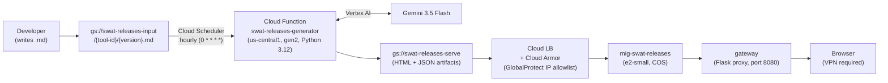

<h1 align="center">swat-releases</h1>
<h4 align="center">Internal release notes portal for PCS SWAT tooling — GCS-hosted, Gemini-processed, VPN-gated.</h4>

<div align="center">


</div>

Developers drop a Markdown file into a GCS bucket and the portal handles the rest: a
Cloud Function picks it up hourly, calls Gemini to structure and format the content, renders
HTML, and publishes it to the serving bucket. The Flask proxy on a managed MIG serves all
requests through Cloud LB with GlobalProtect IP allowlisting.

**Site:** <https://swatreleases.pcs.lab.twistlock.com> (GlobalProtect VPN required)

---

### Quick navigation

[What it does](#what-it-does) | [Prerequisites](#prerequisites) | [Quick start — publishing a release note](#quick-start--publishing-a-release-note) | [Project structure](#project-structure)
[Architecture](#architecture) | [CI/CD and deployment](#cicd-and-deployment) | [Content management](#content-management) | [Known limitations](#known-limitations)

---

## What it does

1. Developer writes release notes as a Markdown file and uploads to
   `gs://swat-releases-input/{tool-id}/{version}.md`
2. Cloud Scheduler fires hourly (`0 * * * *`) → `swat-releases-generator` Cloud Function
3. Function reads each unprocessed `.md` file, calls **Gemini 3.5 Flash** (via Vertex AI) to
   structure and tag the content, and writes a JSON artifact to `gs://swat-releases-serve/`
4. Function renders HTML from the JSON artifact using Jinja2 templates and uploads the page
5. Proxy (`gateway/`) on `mig-swat-releases` serves all requests: Cloud LB → Cloud Armor
   (GlobalProtect IP allowlist) → Flask proxy → GCS
6. Browser receives the release page; deep links `/{tool-id}/{version}` and
   `/{tool-id}/latest` both work

**Hotfixes** use a 4-part version (`YY.M.X.NN`). They append to the parent page's Fixes
section — no new index entry is created and the `latest` pointer is unchanged.

---

## Prerequisites

| Requirement | Version | Notes |
| --- | --- | --- |
| Python | 3.12+ | `python3 --version` |
| gcloud CLI | any recent | `gcloud --version` |
| GCP credentials | — | Application Default Credentials |
| Node.js | any LTS | for `npm run lint` |
| GlobalProtect VPN | — | required to reach the live site |

Install the gcloud CLI: <https://cloud.google.com/sdk/docs/install>

---

## Quick start — publishing a release note

### 1. Write the release notes as `.md`

```markdown
# Cortex Catalyst 26.8.1

## New Features
- Brief description of each new capability

## Improvements
- What got better

## Fixed
- Bug descriptions
```

See [docs/release-notes-standards.md](docs/release-notes-standards.md) for the full tag
taxonomy and content guidelines.

### 2. Upload to the input bucket

```bash
gcloud storage cp 26.8.1.md gs://swat-releases-input/cortex-catalyst/26.8.1.md
```

The site updates within the hour.

### 3. Trigger immediately (optional)

```bash
gcloud scheduler jobs run swat-releases-generator-hourly \
  --location=us-central1 --project=pcs-swat-resources
```

### 4. Verify

Navigate to `https://swatreleases.pcs.lab.twistlock.com/cortex-catalyst/26.8.1` (VPN required).
The `/{tool-id}/latest` path also redirects to the newest version automatically.

---

## Project structure

```text
swat-releases/
├── .github/workflows/
│   ├── deploy-proxy.yml        ← builds proxy Docker image, rolls out MIG
│   └── deploy-generator.yml    ← deploys Cloud Function + Scheduler
├── gateway/                    ← COS proxy container (Flask/gunicorn)
│   ├── Dockerfile
│   ├── main.py                 ← ADC auth to GCS, /latest redirect, URL routing
│   └── requirements.txt
├── scripts/
│   ├── config.py               ← load_config() — reads tools.yaml
│   ├── extract.py              ← GCS .md reader, Gemini caller, JSON artifact writer
│   ├── render.py               ← Jinja2 renderer, GCS uploader
│   ├── generator/
│   │   ├── main.py             ← Cloud Function HTTP entry point
│   │   └── requirements.txt
│   ├── prompts/
│   │   ├── model1_user_facing.txt   ← major release Gemini prompt
│   │   └── model1_hotfix.txt        ← hotfix Gemini prompt
│   └── templates/
│       ├── release-page.html.j2
│       └── catalyst-panel.html.j2
├── config/
│   └── tools.yaml              ← tool registry (add new tools here)
├── images/                     ← brand assets (base64-embedded in release pages)
├── docs/
│   ├── generator-operations.md ← operational runbook (monitoring, correction, troubleshooting)
│   ├── pipeline-operations.md  ← DEPRECATED (old GitHub Actions pipeline, kept for reference)
│   └── release-notes-standards.md
└── tests/
    ├── test_extract.py
    ├── test_render.py
    └── test_generator.py
```

---

## Architecture



**Proxy routing:**

| Path | Resolves to |
| --- | --- |
| `/` | `index.html` |
| `/{tool-id}/{version}` | `{tool-id}/{version}.html` |
| `/{tool-id}/latest` | 302 redirect to current latest version |

---

## CI/CD and deployment

Deployments are fully automated — no manual steps after a merge to `main`.

| Workflow | Trigger | What it does |
| --- | --- | --- |
| `deploy-generator.yml` | Push to `main` — `scripts/**`, `config/**`, `images/**` | Deploys Cloud Function, creates/updates Cloud Scheduler job |
| `deploy-proxy.yml` | Push to `main` — `gateway/**` | Builds `linux/amd64` Docker image, pushes to Artifact Registry, creates instance template, rolls out `mig-swat-releases` |

Both workflows also support manual dispatch for emergency re-deploys.

**GCP resources:**

| Resource | Value |
| --- | --- |
| Input bucket | `gs://swat-releases-input` |
| Serving bucket | `gs://swat-releases-serve` |
| Cloud Function | `swat-releases-generator` (us-central1) |
| Cloud Scheduler | `swat-releases-generator-hourly` (`0 * * * *`) |
| MIG | `mig-swat-releases` |
| Proxy image | `us-central1-docker.pkg.dev/pcs-swat-resources/swat-releases/proxy:latest` |
| Pipeline SA | `swat-releases-pipeline@pcs-swat-resources.iam.gserviceaccount.com` |

**Run tests locally:**

```bash
pip install -r scripts/requirements.txt pytest
PYTHONPATH=. pytest tests/ -v
```

For full operational procedures — monitoring, troubleshooting, local generator runs — see
[docs/generator-operations.md](docs/generator-operations.md).

---

## Content management

### Edit a published release

```bash
# Download the JSON artifact
gcloud storage cp gs://swat-releases-serve/cortex-catalyst/26.8.1.json /tmp/26.8.1.json

# Edit /tmp/26.8.1.json, then upload back
gcloud storage cp /tmp/26.8.1.json gs://swat-releases-serve/cortex-catalyst/26.8.1.json

# Rebuild the index and re-render HTML
PYTHONPATH=. python3 scripts/render.py cortex-catalyst 26.8.1
```

### Delete a release

```bash
gcloud storage rm gs://swat-releases-serve/cortex-catalyst/26.8.1.html
gcloud storage rm gs://swat-releases-serve/cortex-catalyst/26.8.1.json

# Rebuild index to remove the entry from index.html
PYTHONPATH=. python3 -c "from scripts.render import rebuild_index; rebuild_index()"
```

### Force re-process through Gemini

Delete the JSON artifact from the serve bucket, then trigger the scheduler:

```bash
gcloud storage rm gs://swat-releases-serve/cortex-catalyst/26.8.1.json
gcloud scheduler jobs run swat-releases-generator-hourly \
  --location=us-central1 --project=pcs-swat-resources
```

---

## Known limitations

- **Content management requires local Python** — edit/delete/force re-render workflows
  require `PYTHONPATH=` invocations locally with GCP credentials. No web UI exists yet
  (tracked in issue #48).
- **Cortex Unity pages not reformatted** — hand-authored Unity pages predate the current
  Gemini-rendered template and have not been migrated.
- **Dependabot** — 20 moderate/low severity dependency vulnerabilities not yet triaged.
- **`index.html` is partially generator-managed** — the generator rebuilds only
  `<div id="panel-catalyst">`. Other panel divs and all JS/CSS survive each run, but edits
  to those sections of `index.html` in GCS are not version-controlled.
- **Gemini token cost** — each re-process call to `extract.py` consumes Vertex AI tokens.
  Use `--force` deliberately; avoid re-processing unnecessarily.

---

PCS SWAT Team — Palo Alto Networks
