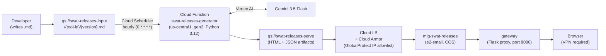

# swat-releases

Release notes portal for PCS SWAT tooling. Served at `https://swatreleases.pcs.lab.twistlock.com` — GlobalProtect VPN required.

Covers Cortex Catalyst, Cortex Insights, and Cortex Unity.

---

## Architecture



**Proxy routing:**

| Path | Resolves to |
| --- | --- |
| `/` | `index.html` |
| `/{tool-id}/{version}` | `{tool-id}/{version}.html` |
| `/{tool-id}/latest` | 302 redirect to current latest version |

---

## Publishing a Release

### 1. Write the release notes as `.md`

```markdown
# Cortex Catalyst 26.8.1

## New Features
- Brief description of each new capability

## Improvements
- What got better

## Fixed
- Bug descriptions
```

### 2. Upload to the input bucket

```bash
gcloud storage cp 26.8.1.md gs://swat-releases-input/cortex-catalyst/26.8.1.md
```

The site updates within the hour. To trigger immediately:

```bash
gcloud scheduler jobs run swat-releases-generator-hourly \
  --location=us-central1 --project=pcs-swat-resources
```

**Hotfixes** use a 4-part version (`26.8.1.01`). They append to the parent page's Fixes section — no new index entry is created.

See [docs/release-notes-standards.md](docs/release-notes-standards.md) for content guidelines and tag taxonomy.

---

## Repository Structure

```text
swat-releases/
├── .github/workflows/
│   ├── deploy-proxy.yml        ← builds proxy Docker image, rolls out MIG
│   └── deploy-generator.yml    ← deploys Cloud Function + Scheduler
├── gateway/                    ← COS proxy container (Flask/gunicorn)
│   ├── Dockerfile
│   ├── main.py
│   └── requirements.txt
├── scripts/
│   ├── config.py               ← load_config() — reads tools.yaml
│   ├── extract.py              ← GCS .md reader, Gemini caller, JSON artifact writer
│   ├── render.py               ← Jinja2 renderer, GCS uploader
│   ├── generator/
│   │   ├── main.py             ← Cloud Function HTTP entry point
│   │   └── requirements.txt
│   ├── prompts/
│   │   ├── model1_user_facing.txt   ← major release Gemini prompt
│   │   └── model1_hotfix.txt        ← hotfix Gemini prompt
│   └── templates/
│       ├── release-page.html.j2
│       └── catalyst-panel.html.j2
├── config/
│   └── tools.yaml              ← tool registry (add new tools here)
├── images/                     ← brand assets (base64-embedded in release pages)
├── docs/
│   ├── generator-operations.md ← operational runbook (monitoring, correction, troubleshooting)
│   ├── pipeline-operations.md  ← DEPRECATED (old GitHub Actions pipeline, kept for reference)
│   └── release-notes-standards.md
└── tests/
    ├── test_extract.py
    ├── test_render.py
    └── test_generator.py
```

---

## GitHub Actions

| Workflow | Trigger | What it does |
| --- | --- | --- |
| `deploy-proxy.yml` | Push to `main` — `gateway/**`; or manual dispatch | Builds linux/amd64 Docker image, pushes to Artifact Registry, creates instance template, rolls out `mig-swat-releases` |
| `deploy-generator.yml` | Push to `main` — `scripts/**`, `config/**`, `images/**`; or manual dispatch | Deploys Cloud Function, creates/updates Cloud Scheduler job |

---

## Local Development

### Run tests

```bash
pip install -r scripts/requirements.txt pytest
PYTHONPATH=. pytest tests/ -v
```

### Test the generator locally

Prerequisites: Python 3.12, GCP credentials with Vertex AI access.

```bash
gcloud auth application-default login
export GOOGLE_CLOUD_PROJECT=pcs-swat-resources
export INPUT_BUCKET=swat-releases-input
export SERVE_BUCKET=swat-releases-serve

# Extract — calls Gemini (costs tokens; use --force to overwrite an existing artifact)
PYTHONPATH=. python3 scripts/extract.py cortex-catalyst 26.8.1 --force

# Render — no external calls
PYTHONPATH=. python3 scripts/render.py cortex-catalyst 26.8.1
```

---

## GCP Resources

| Resource | Value |
| --- | --- |
| Input bucket | `gs://swat-releases-input` |
| Serving bucket | `gs://swat-releases-serve` |
| Cloud Function | `swat-releases-generator` (us-central1) |
| Cloud Scheduler | `swat-releases-generator-hourly` (`0 * * * *`) |
| MIG | `mig-swat-releases` |
| Proxy image | `us-central1-docker.pkg.dev/pcs-swat-resources/swat-releases/proxy:latest` |
| Pipeline SA | `swat-releases-pipeline@pcs-swat-resources.iam.gserviceaccount.com` |

For operational procedures — editing releases, monitoring, troubleshooting — see [docs/generator-operations.md](docs/generator-operations.md).

---

## Branching

```text
main         ← production; merge via PR only
  └── develop ← integration; all work branches from here
        └── feature/issue-N-description
```

- No direct commits to `main` or `develop`
- All branches originate from `develop`, merged `--no-ff` after review
- `develop → main`: PR required, CI must pass

---

PCS SWAT Team — Palo Alto Networks
