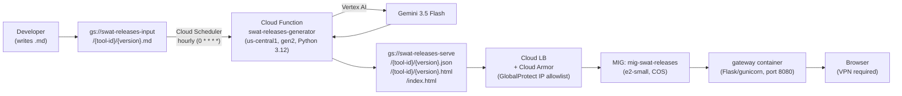
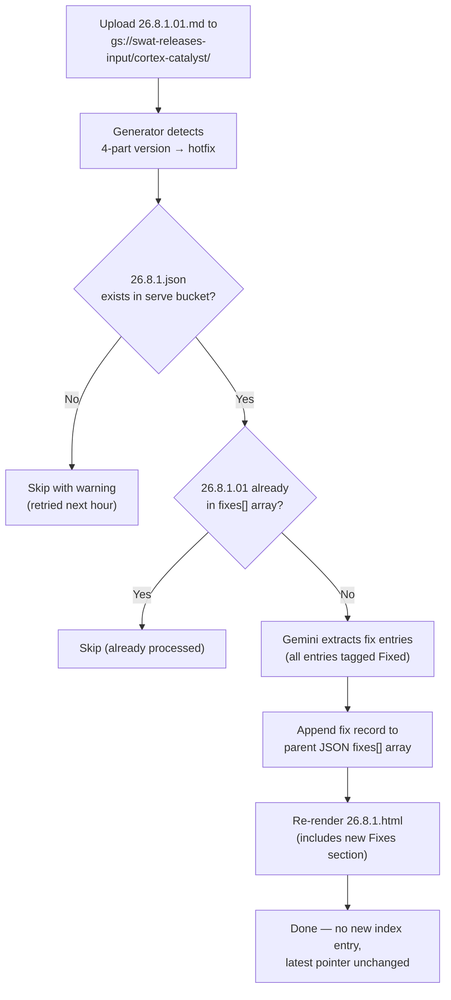

# Generator Operations Reference

The release notes generator runs as a Cloud Function (`swat-releases-generator`) triggered hourly by Cloud Scheduler. It reads `.md` files from `gs://swat-releases-input` and writes rendered HTML to `gs://swat-releases-serve`.

---

## Architecture



**Proxy routing:**

| Path | Resolves to |
| --- | --- |
| `/` | `index.html` |
| `/{tool-id}/{version}` | `{tool-id}/{version}.html` (`.html` appended by proxy) |
| `/{tool-id}/latest` | 302 redirect to current latest version |

---

## Skip Logic

The generator iterates every `.md` file in `gs://swat-releases-input`. Whether it calls Gemini depends on what already exists in the serve bucket:

| Condition | Behavior |
| --- | --- |
| Major release: `{tool-id}/{version}.json` exists in serve bucket | Gemini skipped — existing JSON re-used; HTML re-rendered |
| Major release: no JSON artifact yet | Gemini called; JSON and HTML written |
| Hotfix: parent JSON `fixes[]` already contains this hotfix version | Skipped entirely |
| Hotfix: parent major release not yet in serve bucket | Skipped with warning log; retried next hourly run |
| Unknown `tool-id` (not in `config/tools.yaml`) | Skipped with warning log |

**Note:** Gemini is NOT re-called just because the `.md` file is re-uploaded to the input bucket. Skip logic is controlled entirely by what exists in the serve bucket (`{version}.json`). To force a fresh Gemini call on an already-processed version, delete the JSON artifact from the serve bucket first (see [Force re-extraction](#force-re-extraction)).

---

## Triggering a Run

### Wait for hourly schedule

The scheduler fires at the top of every hour automatically.

### Manual trigger

```bash
gcloud scheduler jobs run swat-releases-generator-hourly \
  --location=us-central1 --project=pcs-swat-resources
```

### Force re-extraction

To force Gemini to re-process an already-processed version, delete its JSON artifact from the serve bucket, then trigger:

```bash
# 1. Delete the existing artifact (removes the skip guard)
gcloud storage rm gs://swat-releases-serve/cortex-catalyst/26.8.1.json

# 2. Trigger the generator
gcloud scheduler jobs run swat-releases-generator-hourly \
  --location=us-central1 --project=pcs-swat-resources
```

The `.md` file must still be present in `gs://swat-releases-input` for the generator to pick it up.

---

## Adding a Release

1. Write release notes in `.md` format (see [release-notes-standards.md](release-notes-standards.md))
1. Name the file `{version}.md` (e.g., `26.8.1.md` for a major release, `26.8.1.01.md` for a hotfix)
1. Upload via the web page or gcloud:

   _Web upload page (no CLI needed):_ Navigate to
   `https://swatreleases.pcs.lab.twistlock.com/upload` (VPN required). Select the tool,
   paste or upload the `.md` file, enter the version, and submit.

   _gcloud CLI:_

   ```bash
   gcloud storage cp 26.8.1.md gs://swat-releases-input/cortex-catalyst/26.8.1.md
   ```

1. Trigger the scheduler job or wait for the next hourly run

---

## Deleting a Release

1. Remove the HTML and JSON artifacts from the serving bucket:

```bash
gcloud storage rm gs://swat-releases-serve/cortex-catalyst/26.8.1.html
gcloud storage rm gs://swat-releases-serve/cortex-catalyst/26.8.1.json
```

1. Remove the source `.md` from the input bucket (prevents re-processing on next hourly run):

```bash
gcloud storage rm gs://swat-releases-input/cortex-catalyst/26.8.1.md
```

1. Trigger the generator — it will rebuild the index panel without the deleted entry:

```bash
gcloud scheduler jobs run swat-releases-generator-hourly \
  --location=us-central1 --project=pcs-swat-resources
```

1. If the deleted version was the `latest`, update the pointer manually:

```bash
# Point latest at the new most-recent version
echo -n "26.7.1" | gcloud storage cp - gs://swat-releases-serve/cortex-catalyst/latest
```

---

## Monitoring

### View recent logs

```bash
gcloud functions logs read swat-releases-generator \
  --gen2 --region=us-central1 --limit=100
```

### Filter for errors only

```bash
gcloud logging read \
  'resource.type="cloud_run_revision" AND jsonPayload.action="error"' \
  --project=pcs-swat-resources --limit=20
```

### Filter for processing summary

```bash
gcloud logging read \
  'resource.type="cloud_run_revision" AND jsonPayload.action="summary"' \
  --project=pcs-swat-resources --limit=10
```

### Check scheduler job history

```bash
gcloud scheduler jobs describe swat-releases-generator-hourly \
  --location=us-central1 --project=pcs-swat-resources
```

---

## Correcting Generated Release Notes

1. Edit the JSON artifact directly in GCS:

```bash
gcloud storage cp gs://swat-releases-serve/cortex-catalyst/26.8.1.json /tmp/26.8.1.json
# edit /tmp/26.8.1.json
gcloud storage cp /tmp/26.8.1.json gs://swat-releases-serve/cortex-catalyst/26.8.1.json
```

1. Re-render by triggering the generator. Because the JSON artifact already exists, Gemini
   is not called — the edited JSON is used directly to regenerate the HTML:

```bash
gcloud scheduler jobs run swat-releases-generator-hourly \
  --location=us-central1 --project=pcs-swat-resources
```

The `.md` file must still be present in `gs://swat-releases-input` for the generator to
pick it up. If it was already removed, re-upload it (the existing JSON artifact acts as the
skip guard — Gemini is not re-called).

---

## Hotfix Processing



### Submitting a hotfix

Write the fix notes as a `.md` file named with the hotfix version (e.g., `26.8.1.01.md`):

```markdown
# Cortex Catalyst 26.8.1.01

## Fixes
- Resolved an issue where multi-document queries returned empty results when
  source documents exceeded 50 pages.
```

Upload to the same tool folder in the input bucket:

```bash
gcloud storage cp 26.8.1.01.md gs://swat-releases-input/cortex-catalyst/26.8.1.01.md
```

The generator detects the 4-part version (`YY.M.X.NN`) and appends the formatted fix entries to the parent major release page (`26.8.1`). The parent release must already be processed before the hotfix is submitted.

### How hotfixes are processed

Hotfix versions (`26.8.1.01`, `26.8.1.02`) are automatically detected by the 4-part version format. The generator:

1. Finds the parent major release JSON (`26.8.1.json`) in the serving bucket
1. Calls Gemini to extract fix entries from the hotfix `.md` — all entries are validated to use the `Fixed` tag; any other tag causes a validation error
1. Appends a fix record to the `fixes[]` array in the parent JSON
1. Re-renders the parent page (`26.8.1.html`) to include the new Fixes section
1. Does NOT create a new index entry or update the `latest` pointer

The parent major release must exist before a hotfix can be processed.

### JSON artifact shape after a hotfix

```json
{
  "version": "26.8.1",
  "date": "August 2026",
  "summary": "...",
  "entries": [...],
  "fixes": [
    {
      "version": "26.8.1.01",
      "date": "August 2026",
      "entries": [
        { "tag": "Fixed", "title": "...", "description": "..." }
      ]
    }
  ]
}
```

---

## Troubleshooting

| Symptom | Likely cause | Fix |
| --- | --- | --- |
| Version not processed, no log entry | `.md` file is named incorrectly or missing `.md` extension | Check `gcloud storage ls gs://swat-releases-input/cortex-catalyst/` |
| Version processed but HTML unchanged | JSON artifact already existed; Gemini not re-called | Edit JSON in GCS and re-trigger, or use force re-extraction (delete JSON first) |
| Hotfix skipped with `parent_not_found` | Parent major release not yet processed | Upload and trigger parent first |
| `RuntimeError: Could not find panel-{tool} div` | `index.html` in serving bucket is malformed or the panel div was renamed/removed | Download from GCS version history and restore; `index.html` is not tracked in git |
| Cloud Function times out (300s limit) | Large number of unprocessed files | Trigger multiple times or process in smaller batches |
| Gemini returns invalid JSON | Model flakiness | Manual trigger re-runs Gemini; check logs for raw response |
| Hotfix validation error: wrong tag | Hotfix `.md` contains non-Fixed entries | Hotfix entries must only describe bug fixes; all entries are validated as `Fixed` |
